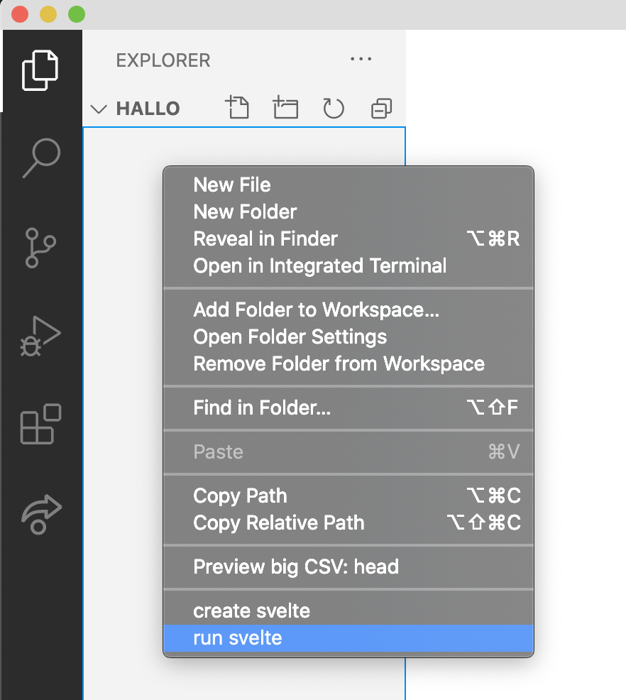

# Svelte-starter

Extension for running svelte from command line (cmd + shif + p) and explorer menu.



## create svelte
```
npx degit sveltejs/template .
npm install
npm run dev
```

## run svelte
```
npm run dev
```